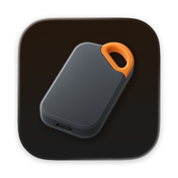
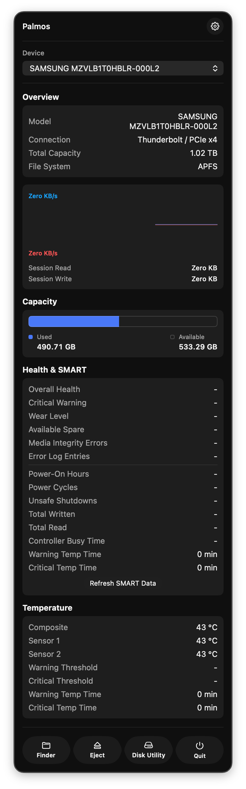
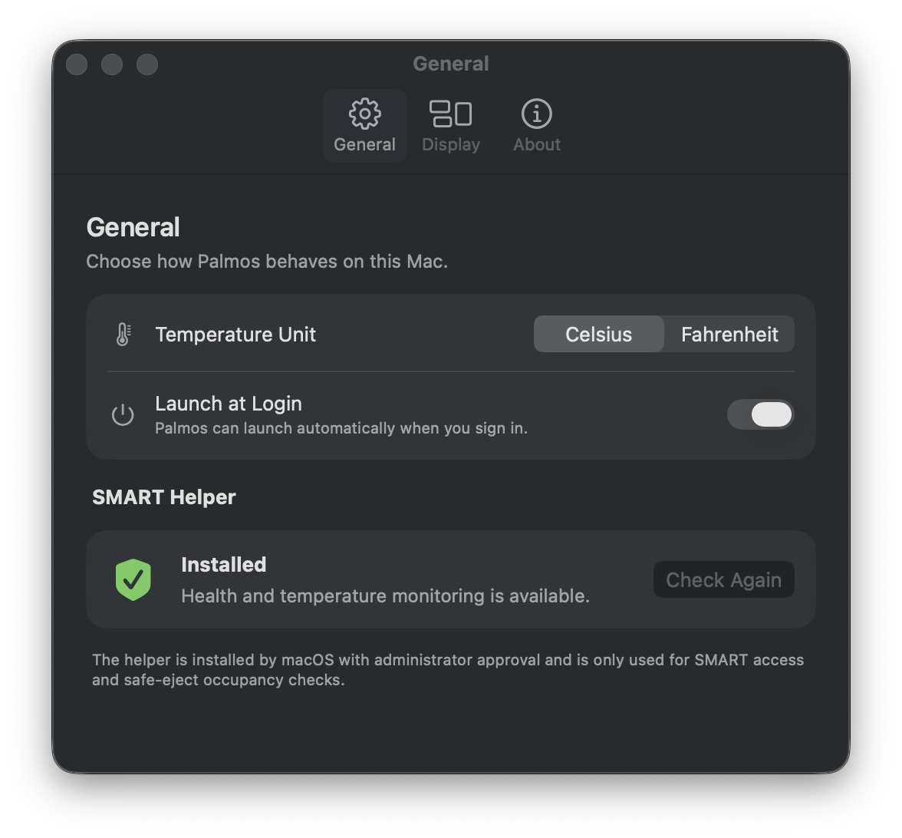

<div align="center">
  
  <h1>Palmos</h1>
</div>

---

<div align="center">
  <p>用于查看外接实体存储设备的原生 macOS 菜单栏应用。</p>
  <p><strong>简体中文</strong> · <a href="README.zh-TW.md">繁體中文</a> · <a href="../README.md">English</a> · <a href="README.ja.md">日本語</a> · <a href="README.ru.md">Русский</a></p>
</div>

Palmos 把拔盘前需要确认的信息放进菜单栏。它以实体设备为顶层，卷和分区显示在设备下方；有多个卷的 APFS 磁盘仍会作为一块磁盘显示。

<table>
  <tr><td width="32%"><strong>一眼看清</strong><br><br>无需打开磁盘工具，即可查看实时读写吞吐、当前连接会话的累计量、容量、已挂载卷和连接链路。</td><td width="68%" align="center"></td></tr>
  <tr><td><strong>可用时读取 SMART</strong><br><br>需要 SMART 健康或温度数据时，可在设置中安装可选的 SMART Helper。未安装时，Palmos 的其他功能仍可使用。</td><td align="center"></td></tr>
</table>

## 可以查看什么

- 实时读写速度，以及当前连接会话的累计读写量。
- 总容量、已用和可用容量；已挂载卷、文件系统和分区。
- USB、Thunderbolt、USB4、SD 或受支持的 PCIe 隧道连接信息。
- 面向整块实体设备的安全弹出。Palmos 会先卸载，再弹出；只有弹出成功才会提示可以移除。若 macOS 报告设备正被占用，Palmos 可协助找出占用者，供你决定下一步。

## 支持设备

Palmos 支持经 USB、Thunderbolt、USB4、SD 以及受支持的 PCIe 隧道连接的外接实体存储，包括外接 SSD、HDD、SD 卡和外接 NVMe 硬盘盒。未挂载的实体设备也可能显示在列表中。

它不会显示内置存储、网络卷、虚拟介质，以及 iPhone 或 iPad 挂载。需要 Apple 芯片（arm64）和 macOS 26 或更高版本。

SMART 与设备发现不同：硬盘本身和硬盘盒或转接器都必须能透传相应命令。部分 USB 转 SATA/NVMe 桥接芯片不透传 SMART，或需要 Palmos 尚不支持的传输模式。遇到这种情况，Palmos 会显示 SMART 不可用或需要传输支持；安装 Helper 不能改变桥接硬件的能力。

## 安装与首次使用

### Homebrew

```bash
brew tap slippindylan/tap
brew trust --tap slippindylan/tap
brew install --cask palmos@beta
```

### DMG 与首次启动

1. 从 [GitHub Releases](https://github.com/SlippinDylan/Palmos/releases) 下载 arm64 DMG，打开后将 `Palmos.app` 拖到 `Applications`。
2. 当前 Release 使用 Apple Development 证书签名，但未经过公证。macOS 可能因下载隔离属性阻止首次启动；遇到这种情况，可仅对已安装的 App 移除该属性：

   ```bash
   xattr -dr com.apple.quarantine /Applications/Palmos.app
   ```

3. 打开 Palmos，连接外接硬盘并点击菜单栏图标。选中设备后即可查看卷、容量、吞吐、拓扑和弹出控制。

这条命令只会移除 `/Applications/Palmos.app` 的下载隔离属性，不能绕过代码签名检查。请勿对不信任的 App 执行它。

## SMART Helper 与更新

SMART Helper 是可选组件。SMART 区域要求安装时，在设置中选择“安装 Helper”，并通过 macOS 的管理员授权。Palmos 会随 Helper 安装自己的受信任 `smartctl` 伴随工具，不会使用 Homebrew 或用户可写目录中的版本。

Palmos 会自动检查 App 更新；也可以在“设置 → 关于 → 检查更新…”手动检查。App 更新只替换 `Palmos.app`，不会静默安装或更新特权 Helper。若 Palmos 要求更新 Helper，请回到“设置 → SMART Helper”操作。

删除 `Palmos.app` 不会移除已安装的 Helper。如需一并卸载，请在确定不再使用 Palmos 后再执行以下命令。它们只针对列出的 Palmos 系统服务和伴随工具，不会操作你的磁盘或数据：

```bash
sudo launchctl bootout system /Library/LaunchDaemons/com.palmos.smartservice.plist
sudo rm /Library/LaunchDaemons/com.palmos.smartservice.plist
sudo rm /Library/PrivilegedHelperTools/com.palmos.smartservice
sudo rm /Library/PrivilegedHelperTools/com.palmos.smartservice.smartctl
```

## 从源码构建

使用安装了 macOS 26 SDK 的 Xcode 26.4 或更新版本打开 `Palmos.xcworkspace`，选择 `PalmosApp` scheme 后构建。未签名构建可在不使用 SMART 的情况下运行。若要构建带 SMART 的 App，App、Helper 和 companion 必须使用同一个 Apple Development Team；配置好签名身份后运行：

```bash
Scripts/build-local-smart-app.sh
```

## 许可证

Copyright © 2025–2026 SlippinDylan Studio。Palmos 使用 [Apache License 2.0](../LICENSE)。

应用包含按 MIT License 发布的 [MenuBarExtraAccess 1.3.0](https://github.com/orchetect/MenuBarExtraAccess)，以及由 smartmontools 7.5 构建、按 GPL version 2 or later 发布的 `smartctl`。完整声明位于 [Shared/Licensing](../Shared/Licensing)。
